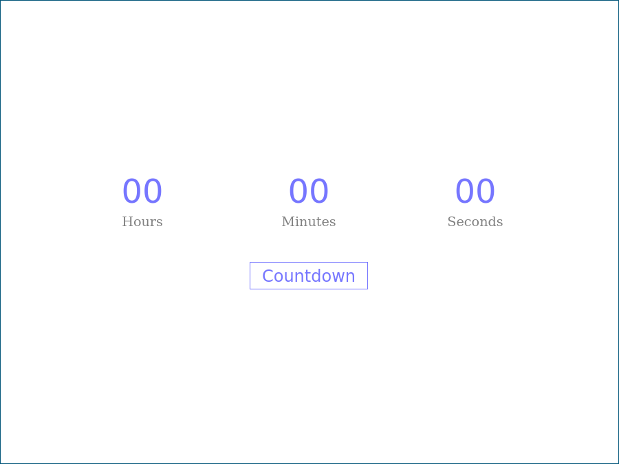
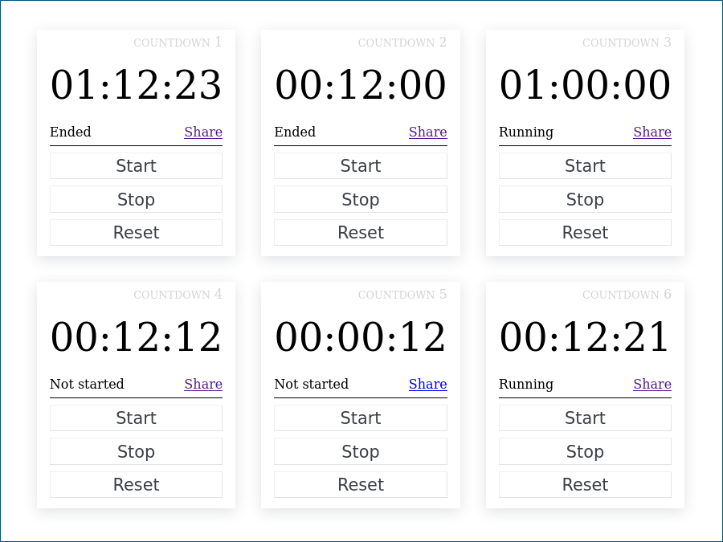
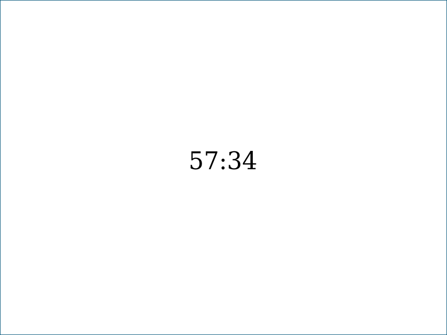
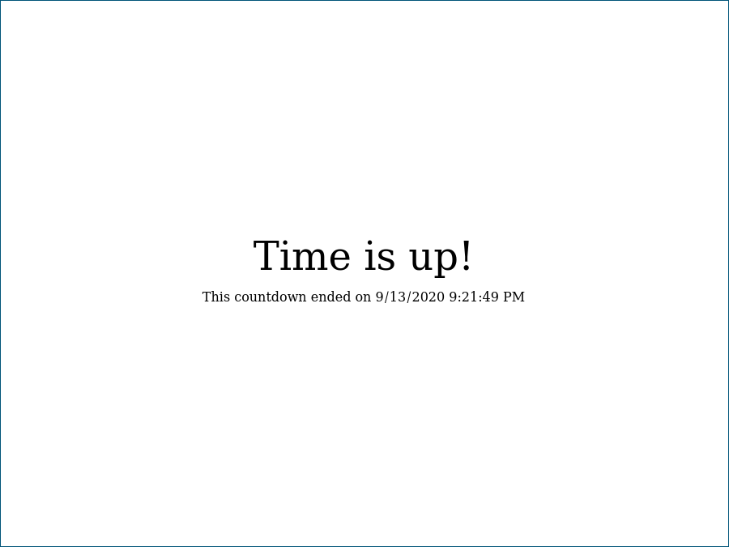

[](https://drone.friedl.net/incubator/netclock)

Netclock is a collection of modules circling around time and shared clocks.

# Getting started
The easiest way to get started with netclock is to start the [docker
image](https://hub.docker.com/repository/docker/arminfriedl/netclock) with

```shell
docker run --rm -p5000:5000 arminfriedl/netclock
```

Then visit [http://localhost:5000/countdown](http://localhost:5000/countdown).

Alternatively, you can build directly from source. You need:
- python3, pip and pipenv
- node and npm
- redis

Start your redis server, then clone the git repository and `cd` into it. Run
```shell
npm run build # or publish for a production build

pipenv install

export FLASK_APP=netclock.py
export FLASK_APP=development # or production
pipenv run flask 
```
Then visit [http://localhost:5000/countdown](http://localhost:5000/countdown).

# Countdown
The countdown module allows you to create shared countdowns that are
synchronized with a central server. After creating a countdown you can share a
countdown link to get a shared view of the time left until it reaches zero. A
running version can also be found on
[https://netclock.friedl.net/countdown](https://netclock.friedl.net/countdown)
(please don't abuse it or I'll have to restrict access).

Here are some impressions:

Create a countdown:



Manage all your countdowns:



View a countdown (can be shared and is synchronized between all viewers):





# Roadmap
The current roadmap contains:
- A worldclock with conversion between different time zones
- A synchronized, timezone-aware clock
- More customization options and skinning for users
- Security improvements (it's only clocks but still)
- Pre-made clock configurations for e.g. time-boxing in scrum
- Native clients

# Contributing
While netclock is still in incubator phase (i.e. before version 1.0) its main
repository is hosted on https://git.friedl.net/incubator/netclock with a mirror
on https://github.com/arminfriedl/netclock. With the first stable release it
will most likely move to GitHub as its main repository.

If you want to contribute, you can either issue a pull request on its Github
mirror (will be cherry picked into the main repository) or send patches to
dev[at]friedl[dot]net.

If you are interested in long-term contributions you can also drop me a
mail for an account on https://git.friedl.net.
